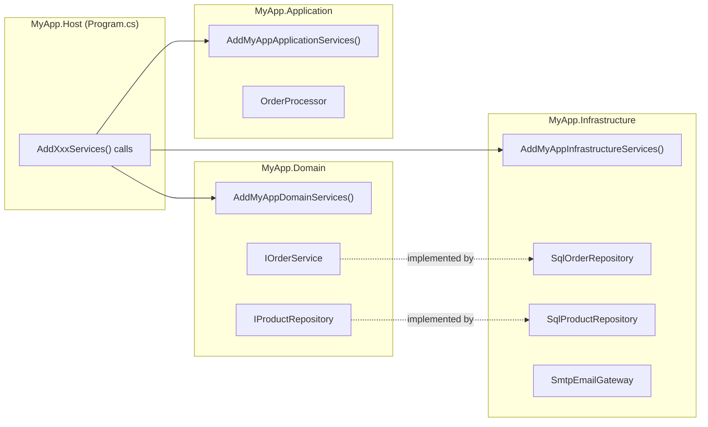

# Advanced Patterns

This guide covers patterns that go beyond basic service registration: wiring up services across multiple assemblies, disambiguating constructors when a class has more than one, injecting all implementations of an interface at once, avoiding the captive dependency pitfall, and working around the compile-time closed-type requirement for open generics in standalone mode.

## Multi-Assembly Setup

Each assembly that contains ZeroAlloc.Inject-annotated services generates its own `IServiceCollection` extension method. The method name is derived from the assembly name by stripping dots, capitalising segment boundaries, and appending `Services` — so `MyApp.Domain` becomes `AddMyAppDomainServices()`. Assemblies generate independently: the source generator only sees the types declared in the assembly it is currently compiling.

To use services from multiple assemblies in a single composition root, call each generated extension method in sequence:

```csharp
// Program.cs
var builder = WebApplication.CreateBuilder(args);
builder.Services
    .AddMyAppDomainServices()         // from MyApp.Domain assembly
    .AddMyAppInfrastructureServices() // from MyApp.Infrastructure assembly
    .AddMyAppApplicationServices();   // from MyApp.Application assembly
```

The MS DI container (or the hybrid generated container) resolves cross-assembly dependencies at runtime exactly as it would with any other multi-project application — a service in `MyApp.Application` that depends on `IOrderRepository` from `MyApp.Domain` simply declares `IOrderRepository` in its constructor, and the container satisfies it from whichever assembly registered the implementation.



Key points to keep in mind:

- **Each assembly generates independently.** Services in `MyApp.Domain` can reference interfaces from `MyApp.Domain` in their constructors; the generator will resolve them within that assembly. They cannot see — and do not need to know about — implementations in `MyApp.Infrastructure`.
- **Cross-assembly dependencies are resolved at runtime by the DI container**, in exactly the same way they would be in any multi-project .NET application.
- **The default `TryAdd` semantics mean the first registration wins.** If two assemblies both register an implementation of `IProductRepository`, the first call to the matching extension method takes precedence and subsequent calls are silently skipped.
- **You can override the generated method name** for any assembly using an assembly-level attribute. This is useful when the assembly name is long, changes during a refactor, or you are writing a reusable library:

  ```csharp
  // In MyApp.Domain/AssemblyInfo.cs (or any file in the assembly)
  [assembly: ZeroAllocInject("AddDomainServices")]
  ```

  The call site then becomes `builder.Services.AddDomainServices()`.

---

## Multiple Constructors

By default, ZeroAlloc.Inject requires a service class to have exactly one public constructor. If two or more public constructors exist and none is marked, the generator emits a **ZAI009** compile error:

```
ZAI009  error  'ReportGenerator' has multiple public constructors. Mark the one to use with [ActivatorUtilitiesConstructor].
```

This situation often arises when a class has one constructor for production use (with injected dependencies) and a second for tests (with no external dependencies or with test doubles passed directly). The solution is to mark the production constructor with `[ActivatorUtilitiesConstructor]`, which is part of `Microsoft.Extensions.DependencyInjection.Abstractions`:

```csharp
using Microsoft.Extensions.DependencyInjection.Abstractions;
using ZeroAlloc.Inject;

[Transient]
public class ReportGenerator
{
    private readonly IReportRepository _repo;
    private readonly IEmailGateway _email;

    // This constructor is used by the DI container
    [ActivatorUtilitiesConstructor]
    public ReportGenerator(IReportRepository repo, IEmailGateway email)
    {
        _repo = repo;
        _email = email;
    }

    // This constructor is for testing (no external dependencies)
    public ReportGenerator()
    {
        _repo = new InMemoryReportRepository();
        _email = new FakeEmailGateway();
    }
}
```

The generator reads `[ActivatorUtilitiesConstructor]` at compile time (it looks for an attribute named `ActivatorUtilitiesConstructorAttribute` on any constructor of the class) and uses that constructor's parameter list to generate the `new ReportGenerator(...)` call. The no-argument constructor is ignored by the generator entirely.

This attribute is already present in `Microsoft.Extensions.DependencyInjection.Abstractions`, which every project referencing ZeroAlloc.Inject implicitly depends on via the `ZeroAlloc.Inject` package. No additional NuGet reference is needed.

> **Only one constructor may carry `[ActivatorUtilitiesConstructor]`** per class. If multiple constructors are marked, the generator treats the situation as ambiguous and still emits ZAI009.

---

## Resolving All Implementations with `IEnumerable<T>`

When multiple classes implement the same interface and each is annotated with `AllowMultiple = true`, the MS DI container registers all of them. Any constructor that declares `IEnumerable<T>` for that interface receives every registered implementation injected as a sequence.

This pattern is useful wherever a single operation must be applied to a variable, open-ended set of handlers — notification channels, validation rules, pipeline steps, or event subscribers.

```csharp
[Transient(AllowMultiple = true)]
public class EmailNotifier : INotifier { ... }

[Transient(AllowMultiple = true)]
public class SmsNotifier : INotifier { ... }

[Transient(AllowMultiple = true)]
public class PushNotifier : INotifier { ... }

// Consumer
[Transient]
public class NotificationDispatcher
{
    private readonly IEnumerable<INotifier> _notifiers;

    public NotificationDispatcher(IEnumerable<INotifier> notifiers)
    {
        _notifiers = notifiers;
    }

    public async Task DispatchAsync(string message)
    {
        foreach (var notifier in _notifiers)
            await notifier.SendAsync(message);
    }
}
```

When `NotificationDispatcher` is resolved, MS DI supplies all three `INotifier` implementations in registration order.

Real-world uses for this pattern include:

- **Notification channels** — email, SMS, push, Slack, webhook
- **Validation pipelines** — each validator checks one business rule; the dispatcher runs them all
- **Domain event handlers** — multiple handlers subscribed to the same event type
- **Middleware steps** — an ordered pipeline built from independently registered stages

### Standalone mode caveat

`IEnumerable<T>` injection works because MS DI (and the generated hybrid container) natively supports it. In hybrid mode, `IEnumerable<T>` resolution is handled by the generated container's explicit `IEnumerable<T>` type-switch branches, which the generator emits for every service type that has more than one registered implementation within the assembly.

In **pure standalone mode**, `IEnumerable<T>` is also supported for types whose multiple implementations are all registered within the same assembly. The generator emits the same `IEnumerable<T>` type-switch branches in `GenerateStandaloneServiceProviderClass` — it groups all registrations by service type (transient, singleton, and scoped alike) and emits an `if (serviceType == typeof(IEnumerable<TService>))` branch that returns an array of every matching implementation. However, if the implementations are spread across multiple assemblies and you are using standalone providers per assembly, cross-assembly `IEnumerable<T>` resolution is not handled — use hybrid mode or the plain MS DI extension method in that scenario.

---

## The Captive Dependency Pitfall (Scoped inside Singleton)

A *captive dependency* occurs when a singleton service holds a direct reference to a scoped service. Scoped services are designed to be created once per scope (once per HTTP request in ASP.NET Core) and then discarded. When a singleton captures one at construction time, that scoped instance lives for the entire application lifetime — it never gets replaced. In a web application, this means the same per-request state object is shared across every request, every user, and every thread simultaneously.

```csharp
[Singleton]
public class OrderCache
{
    // BUG: OrderContext is scoped, but OrderCache is singleton.
    // The same OrderContext instance is reused across ALL requests.
    public OrderCache(IOrderContext context) { ... }
}
```

Symptoms are subtle and intermittent: users see each other's basket contents, totals are calculated from the wrong line items, or state accumulated during one request bleeds into the next. These bugs are notoriously hard to reproduce in development because they only manifest under concurrent load.

### What ZeroAlloc.Inject detects — and what it does not

ZeroAlloc.Inject performs **compile-time circular dependency detection** (ZAI014). If service A depends on service B which depends back on A, the generator reports the cycle as a build error before the application is ever run. This is a different problem from captive dependency.

Lifetime mismatch — a singleton injecting a scoped service — is **not** detected by the generator. The generator sees only the constructor parameter type; it does not track which lifetime each resolved type will carry at runtime. MS DI provides runtime validation via `ValidateScopes` (enabled by default in the development environment in ASP.NET Core) and will throw an `InvalidOperationException` at startup if a scope validation error is detected. In production, where scope validation is typically disabled, the bug is silent.

### How to avoid it

**Option 1: Inject `IServiceScopeFactory` and create a short-lived scope explicitly.**

Instead of holding the scoped service as a field, the singleton creates a new scope on demand, resolves the service within that scope, uses it, and disposes the scope. This is the correct way to consume scoped services from a singleton:

```csharp
[Singleton]
public class OrderCache
{
    private readonly IServiceScopeFactory _scopeFactory;

    public OrderCache(IServiceScopeFactory scopeFactory)
    {
        _scopeFactory = scopeFactory;
    }

    public async Task<Order> GetOrderAsync(int id)
    {
        using var scope = _scopeFactory.CreateScope();
        var repo = scope.ServiceProvider.GetRequiredService<IOrderRepository>();
        return await repo.GetByIdAsync(id);
    }
}
```

`IServiceScopeFactory` is itself a singleton — it is safe to inject into another singleton. The scope created by `_scopeFactory.CreateScope()` has a bounded, explicit lifetime controlled by the `using` statement, so the `IOrderRepository` inside it lives only for the duration of one `GetOrderAsync` call.

**Option 2: Use the Options pattern for per-configuration state.**

If the data the singleton needs is configuration rather than per-request state, model it as an `IOptions<T>` or `IOptionsSnapshot<T>` value object. Singletons can safely depend on `IOptions<T>` (a singleton itself); use `IOptionsSnapshot<T>` (scoped) with caution by applying the same scope-factory pattern above if you need per-request reconfiguration.

**Option 3: Promote the singleton to a scoped service.**

If the singleton genuinely needs access to per-request data on every call, consider whether it should actually be scoped itself. Singletons are appropriate for shared, thread-safe, long-lived resources; if the cache must be per-request, a `[Scoped]` annotation is the right answer.

---

## Open Generics in Standalone Mode

The standalone container resolves services via a compile-time `if`/`else if` type-switch emitted by the generator. This switch can only contain branches for types that are known at compile time. For open generic services such as `IInventory<T>`, the generator cannot add a single generic branch; it must enumerate every closed form that will actually be needed.

The generator discovers closed usages by analysing every constructor parameter across the entire assembly at compile time. If `IInventory<Product>` appears as a constructor parameter somewhere in the assembly, the generator emits a `typeof(IInventory<Product>)` branch in the type-switch and the service is resolvable. If no constructor in the assembly ever mentions `IInventory<Product>`, the generator emits a **ZAI018 warning**:

```
ZAI018  warning  Open generic 'InMemoryInventory<T>' is registered but no closed usages were detected in this assembly. It will not be resolvable from the standalone or hybrid container.
```

This applies to both standalone mode and hybrid mode for the generator's own type-switch. In hybrid mode, open generics not covered by the type-switch fall through to the MS DI fallback; in standalone mode there is no fallback and the service will not be resolvable.

### Workaround: ensure a closed usage exists in the assembly

The simplest fix is to make sure at least one constructor in the assembly declares the closed form as a parameter. If no existing service naturally takes the type, you can add a minimal consumer class:

```csharp
// Ensures IInventory<Product> is resolved in standalone mode.
// This class can be internal; it does not need to be used at runtime.
[Transient]
internal class ProductInventoryConsumer
{
    public ProductInventoryConsumer(IInventory<Product> inventory) { }
}
```

Once the generator sees `IInventory<Product>` as a constructor parameter anywhere in the assembly, it emits the corresponding branch in the type-switch and the ZAI018 warning disappears.

If multiple closed forms are needed, each requires at least one constructor reference:

```csharp
[Transient]
public class InventorySeeder
{
    // Three closed forms — generator will emit branches for all three
    public InventorySeeder(
        IInventory<Product> products,
        IInventory<Order> orders,
        IInventory<Supplier> suppliers) { }
}
```

### Alternative: switch to hybrid mode

If adding stub consumers is undesirable or the closed forms are determined at runtime (e.g., resolved via `provider.GetRequiredService(type)` with a `Type` variable), switch to the **hybrid container**. The hybrid mode's generated type-switch covers compile-time-detected closed forms for performance, but anything not matched falls through to the MS DI inner provider, which handles open generic registration natively:

```csharp
// In hybrid mode, IInventory<T> open generic is handled by MS DI fallback
var services = new ServiceCollection();
services.AddMyAppServices();
var provider = services.BuildZeroAllocInjectServiceProvider();

var inventoryType = typeof(IInventory<>).MakeGenericType(typeof(Product));
var inventory = (IInventory<Product>)provider.GetRequiredService(inventoryType);
```

See [Container Modes](container-modes.md) for a full comparison of when to use each mode.
