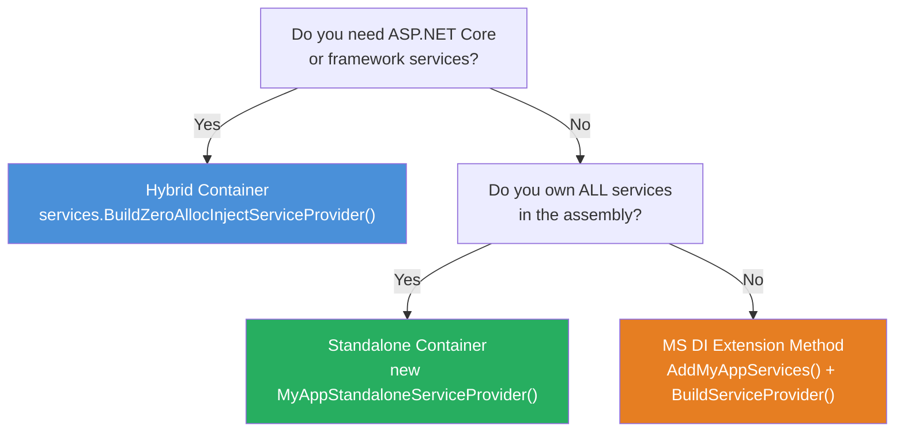
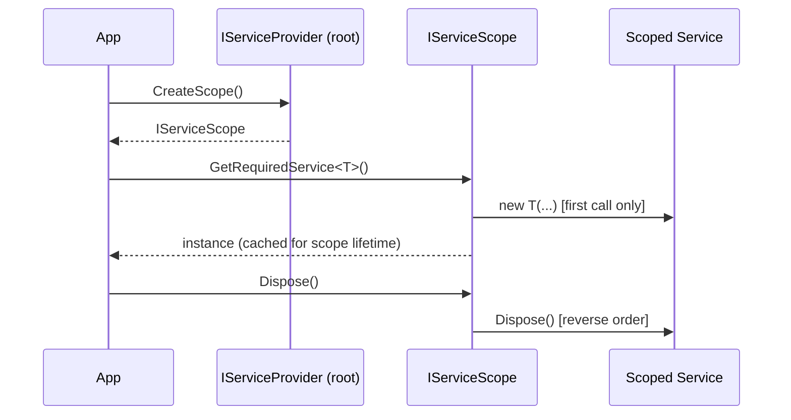

# Container Modes

ZeroAlloc.Inject offers three ways to integrate with the .NET DI system. Each mode sits at a different point on the spectrum between full MS DI compatibility and maximum performance with zero runtime dependencies. Understanding the differences — startup cost, memory overhead, AOT compatibility, and whether framework services need to be resolvable — will help you pick the right mode for each project.

All three modes share the same source-generator front end: you annotate your services with `[Transient]`, `[Scoped]`, or `[Singleton]` and the generator does the heavy lifting at compile time. The choice of mode only affects what happens when the application starts up and resolves services at runtime.

## Choosing a Mode



Use the **MS DI Extension Method** when you want compile-time registration but need to stay on the standard MS DI runtime — for example, when integrating with third-party libraries that register their own services into `IServiceCollection`. Use the **Hybrid Container** when you are building an ASP.NET Core application or any hosted service that must resolve framework-owned types such as `IOptions<T>`, `IHttpClientFactory`, or `IHostedService` alongside your own services. Use the **Standalone Container** when you own every service in the graph, do not need framework integration, and want the smallest possible startup cost and memory footprint — console tools, background workers, and microservices compiled with Native AOT are ideal candidates.

## Mode 1: MS DI Extension Method

### What It Does

The generator produces an `AddMyAppServices()` extension method on `IServiceCollection` (named after your assembly). Calling this method registers all annotated services into the collection using compile-time-generated `TryAdd` calls. You then call `BuildServiceProvider()` yourself, which hands control back to the standard MS DI runtime.

### Package

```
dotnet add package ZeroAlloc.Inject
dotnet add package ZeroAlloc.Inject.Generator
```

### When to Use

- You want compile-time registration validation (ZAI diagnostics at build time rather than runtime exceptions) but need to keep the MS DI runtime for compatibility with existing infrastructure.
- Third-party packages register their own services into `IServiceCollection` and you must not replace the underlying provider.
- Gradual adoption: you are migrating a large existing application and want to start with generated registration before switching to a generated container.

### Console App

```csharp
var services = new ServiceCollection();
services.AddMyAppServices();
using var provider = services.BuildServiceProvider();
var orderService = provider.GetRequiredService<IOrderService>();
```

### ASP.NET Core

```csharp
var builder = WebApplication.CreateBuilder(args);
builder.Services.AddMyAppServices();
var app = builder.Build();
```

### What You Get

Service registration is validated at compile time — missing dependencies, circular references, and invalid attribute combinations are reported as build errors or warnings rather than runtime exceptions. Resolution performance is identical to plain MS DI because `BuildServiceProvider()` produces a standard `ServiceProvider` instance.

### Limitations

- Constructor resolution at runtime still uses MS DI's reflection-based instantiation. The generator writes the registration; it does not replace the resolver.
- Startup cost and per-scope memory are the same as a vanilla MS DI `BuildServiceProvider()`.

---

## Mode 2: Hybrid Container

### What It Does

The hybrid container wraps the generated type-switch resolver around a standard MS DI `IServiceProvider`. When a service is requested, the generated `ResolveKnown(type)` method is tried first: it executes an `if`/`else if` chain on `typeof(T)` and instantiates the service with a direct `new` call if matched. If `ResolveKnown` returns `null` (because the type is not among the annotated services), the call falls through to the MS DI inner provider, which handles framework services, third-party registrations, and open generics.

This is implemented in `ZeroAllocInjectServiceProviderBase`:

```
ResolveKnown(serviceType) ?? _fallback.GetService(serviceType)
```

### Package

```
dotnet add package ZeroAlloc.Inject.Container
```

This single package includes the generator, attributes, and the container base classes. No separate `ZeroAlloc.Inject` or `ZeroAlloc.Inject.Generator` package is required.

### When to Use

- ASP.NET Core or Generic Host applications where framework services (`HttpContext`, `IOptions<T>`, `IHttpClientFactory`, `IHostedService`, etc.) must be resolvable alongside your own services.
- You want faster resolution and lower memory for your services but cannot cut the tie to MS DI.
- You want `UseServiceProviderFactory` integration with the ASP.NET Core host.

### Console App

```csharp
var services = new ServiceCollection();
services.AddMyAppServices();
var provider = services.BuildZeroAllocInjectServiceProvider();
var orderService = provider.GetRequiredService<IOrderService>();
```

### ASP.NET Core

```csharp
var builder = WebApplication.CreateBuilder(args);
builder.Services.AddMyAppServices();
builder.Host.UseServiceProviderFactory(new ZeroAllocInjectServiceProviderFactory());
var app = builder.Build();
```

`ZeroAllocInjectServiceProviderFactory` implements `IServiceProviderFactory<IServiceCollection>`, which is the standard extension point that ASP.NET Core uses when building the host's service provider.

### How It Works

1. `services.AddMyAppServices()` populates the `IServiceCollection` with descriptors for all annotated services.
2. `BuildZeroAllocInjectServiceProvider()` (or the factory's `CreateServiceProvider`) calls `services.BuildServiceProvider()` to create the MS DI inner provider, then wraps it in the generated provider subclass.
3. Every `GetService` call checks `ResolveKnown` first. Annotated services are resolved via generated `new` calls. Everything else is delegated to the inner MS DI provider.
4. `CreateScope()` creates both a generated scope and a corresponding MS DI fallback scope, then wraps them together so that scoped framework services are also available within the scope.

### Open Generics

Open generic types (e.g., `IRepository<>`) are delegated to the MS DI fallback in hybrid mode. The fallback handles open-generic registration natively.

### Startup Cost

The hybrid container has a one-time build cost (~4,477 ns / 9,368 B in benchmarks) because it must both populate MS DI's internal structures and set up the generated wrapper. This cost is paid once at startup, not on every resolution.

---

## Mode 3: Standalone Container

### What It Does

The standalone container is a fully self-contained `IServiceProvider` with no dependency on `Microsoft.Extensions.DependencyInjection` at runtime. It is instantiated directly with `new` — there is no `ServiceCollection`, no `BuildServiceProvider()`. Services that are not annotated with ZeroAlloc.Inject attributes return `null`; there is no fallback.

### Package

```
dotnet add package ZeroAlloc.Inject.Container
```

### When to Use

- Console tools, background workers, or microservices where you own every service in the graph and have no need for framework integration.
- Applications published with Native AOT, where MS DI's reflection-based internals are undesirable or incompatible.
- Scenarios where startup time and memory footprint must be minimised (e.g., serverless functions with cold-start penalties).

### Code Example

```csharp
using var provider = new MyAppStandaloneServiceProvider();
var orderService = provider.GetRequiredService<IOrderService>();
```

The generated class name follows the pattern `<AssemblyName>StandaloneServiceProvider` inside the `ZeroAlloc.Inject.Generated` namespace. For example:

```csharp
using var provider = new ZeroAlloc.Inject.Generated.ZeroAllocInjectSampleStandaloneServiceProvider();
var inventory = provider.GetRequiredService<IInventory<Product>>();
```

### Implemented Interfaces

The generated standalone provider implements:

- `IServiceProvider`
- `IServiceScopeFactory`
- `IServiceProviderIsService`
- `IServiceProviderIsKeyedService`
- `IDisposable`
- `IAsyncDisposable`

### Singleton Lifecycle

Singleton instances are stored in generated fields on the provider class. Lazy initialisation uses `Interlocked.CompareExchange` so that the first thread to construct the instance wins and all subsequent callers receive the cached value — no locks, no double-checked locking pattern, no race conditions.

### Scoped Lifecycle

`CreateScope()` returns a typed scope class generated alongside the provider. Each scope maintains its own cache of scoped instances. On first resolution within a scope, the service is constructed and the instance is stored. All subsequent resolutions within the same scope return the cached instance. When the scope is disposed, every `IDisposable` or `IAsyncDisposable` service is disposed in reverse construction order.

### Open Generics

In standalone mode, open generic types cannot be registered with `typeof(IRepository<>)` at runtime (there is no runtime to query). Instead, the generator analyses constructor parameters across the entire assembly at compile time to enumerate every closed form (e.g., `IRepository<Order>`, `IRepository<Product>`) that is actually used. Each closed form gets its own branch in the type-switch. If no closed usages are found, the generator emits a **ZAI018** warning: "It will not be resolvable from the standalone or hybrid container." ZAI018 applies to both standalone and hybrid mode, because the hybrid container's generated resolver also relies on compile-time closed forms for open generics registered via ZeroAlloc.Inject attributes.

### Unknown Services

Unknown service types return `null`. There is no fallback provider. If you need a service that is not annotated with ZeroAlloc.Inject, you either annotate it or switch to the hybrid mode.

---

## Scope Lifecycle

Scoped services exist for the lifetime of an `IServiceScope`. A scope is a child context created from any `IServiceProvider` that also implements `IServiceScopeFactory` — both the standalone and hybrid providers implement this interface directly.

### How Disposal Works

When a scope is disposed, all tracked instances are disposed in **reverse construction order**: the last service created within the scope is disposed first. This mirrors the standard MS DI behaviour and ensures that services with dependencies are not disposed before the services that depend on them.

The method used for disposal depends on how the scope itself is disposed:

- **`await using` / `DisposeAsync()`** — if a service implements `IAsyncDisposable`, `DisposeAsync()` is awaited; otherwise `Dispose()` is called.
- **`using` / `Dispose()`** — only `IDisposable` is invoked. Services that implement `IAsyncDisposable` but **not** `IDisposable` are **not disposed** when the scope is disposed synchronously.

> **Recommendation:** prefer `await using` in async contexts whenever any scoped service may implement only `IAsyncDisposable` (e.g., `DbContext`, `HttpClient` wrappers). Using synchronous `Dispose()` in those cases silently skips async cleanup.



### Using a Scope

Always dispose scopes when you are done with them, either with a `using` statement or an explicit `Dispose()` call:

```csharp
using var scope = provider.CreateScope();
var repo = scope.ServiceProvider.GetRequiredService<IOrderRepository>();
// use repo...
// scope.Dispose() called here — disposes repo if IDisposable
```

In async contexts, prefer `await using` to invoke `DisposeAsync()`:

```csharp
await using var scope = provider.CreateScope();
var repo = scope.ServiceProvider.GetRequiredService<IOrderRepository>();
await repo.SaveChangesAsync();
// scope.DisposeAsync() called here — awaits async disposal if available
```

A scope obtained from a standalone provider tracks all disposables in a `List<object>` guarded by a lock. Open-generic scoped instances are tracked in a separate `Dictionary<Type, object>` within the same scope, also guarded by the same lock.

---

## Trade-off Comparison Table

|                              | MS DI Extension         | Hybrid Container           | Standalone Container          |
|------------------------------|-------------------------|----------------------------|-------------------------------|
| Runtime dependency           | MS DI                   | MS DI                      | None                          |
| Startup cost                 | Normal MS DI (~139 ns)  | Higher (~4,477 ns)         | ~5 ns                         |
| Memory per scope             | MS DI baseline (~128 B) | ~216 B                     | ~88 B                         |
| Framework services           | ✅                      | ✅                         | ❌ (returns null)             |
| Native AOT (known services)  | ✅                      | ✅                         | ✅                            |
| Native AOT (unknown services)| N/A                     | ⚠️ reflection via MS DI   | N/A                           |
| Open generics                | ✅ MS DI handles        | delegated to MS DI         | compile-time closed           |
| Best for                     | Gradual adoption        | ASP.NET Core apps          | Owned-service apps, AOT       |

Benchmark numbers are from .NET 9.0, BenchmarkDotNet v0.15.8, Windows 11 (Intel Core i9-12900HK), x64 RyuJIT AVX2. See the [performance page](performance.md) for full resolution tables.
