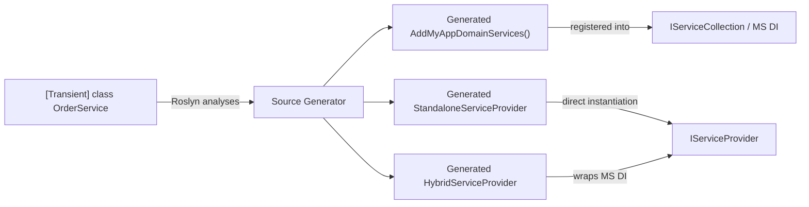

# Getting Started with ZeroAlloc.Inject

## What is ZeroAlloc.Inject?

ZeroAlloc.Inject is a compile-time Roslyn source generator for .NET that eliminates the need for reflection-based dependency injection wiring. Instead of scanning assemblies at runtime, it auto-discovers your services through attributes (`[Transient]`, `[Scoped]`, `[Singleton]`) placed directly on your classes, and at build time it generates strongly-typed `IServiceCollection` extension methods along with both a Hybrid and a fully Standalone `IServiceProvider` implementation. Because the generator emits plain `new ClassName(...)` constructor calls — with all dependencies resolved statically — there is no runtime reflection, no assembly scanning, and no startup overhead. The generated providers are fully compatible with .NET Native AOT publishing, making ZeroAlloc.Inject suitable for applications where startup speed and binary size are critical.

---

## Installation

ZeroAlloc.Inject is distributed as separate, composable NuGet packages so you can adopt as much or as little as you need.

### Attributes + Generator (recommended for most projects)

Reference the attributes package alongside the Roslyn generator. The generator package has `PrivateAssets="all"` so it does not become a transitive dependency of consumers of your library.

```xml
<ItemGroup>
  <PackageReference Include="ZeroAlloc.Inject" Version="*" />
  <PackageReference Include="ZeroAlloc.Inject.Generator" Version="*"
                    PrivateAssets="all" />
</ItemGroup>
```

Or via the .NET CLI:

```bash
dotnet add package ZeroAlloc.Inject
dotnet add package ZeroAlloc.Inject.Generator
```

### All-in-one container package

`ZeroAlloc.Inject.Container` bundles the attributes, the generator, and the base classes required by the generated Standalone and Hybrid providers. Use this when you want everything in a single reference.

```xml
<ItemGroup>
  <PackageReference Include="ZeroAlloc.Inject.Container" Version="*" />
</ItemGroup>
```

Or via the .NET CLI:

```bash
dotnet add package ZeroAlloc.Inject.Container
```

### Which should I choose?

| Scenario | Recommended package(s) |
|---|---|
| ASP.NET Core / Generic Host app using Microsoft DI | `ZeroAlloc.Inject` + `ZeroAlloc.Inject.Generator` |
| Console app or Native AOT app that wants zero MS DI runtime dependency | `ZeroAlloc.Inject.Container` |
| Class library that exposes services to a host application | `ZeroAlloc.Inject` + `ZeroAlloc.Inject.Generator` |
| You want Hybrid mode (generated provider wrapping MS DI) | `ZeroAlloc.Inject.Container` |

> **Targets:** .NET 8, 9, and 10 / C# 12 or later.

---

## Your First Service

### 1. Annotate your services

Add the appropriate lifetime attribute to each class you want registered. You do not need to change your class hierarchy — the attributes sit alongside your existing code.

```csharp
// Services/OrderService.cs
using ZeroAlloc.Inject;

[Transient]
public class OrderService : IOrderService
{
    private readonly IProductRepository _products;

    public OrderService(IProductRepository products)
    {
        _products = products;
    }

    public async Task<Order> PlaceOrderAsync(Cart cart) { /* ... */ }
}

[Scoped]
public class ProductRepository : IProductRepository
{
    private readonly AppDbContext _db;

    public ProductRepository(AppDbContext db)
    {
        _db = db;
    }
}

[Singleton]
public class PricingCache : IPricingCache
{
    // Constructed once for the application lifetime
}
```

### 2. Call the generated extension method

The generator creates an `IServiceCollection` extension method whose name is derived from your **assembly name**: the `Add` prefix is prepended, dots are removed, and `Services` is appended.

| Assembly name | Generated method |
|---|---|
| `MyApp` | `AddMyAppServices()` |
| `MyApp.Domain` | `AddMyAppDomainServices()` |
| `Acme.Store.Infrastructure` | `AddAcmeStoreInfrastructureServices()` |

In your host setup call it exactly as you would any other extension method:

```csharp
// Program.cs
var builder = WebApplication.CreateBuilder(args);

// One call — all [Transient], [Scoped], and [Singleton] services in the
// assembly are registered. Generated entirely at compile time.
builder.Services.AddMyAppDomainServices();

var app = builder.Build();
app.Run();
```

### 3. Override the generated name (optional)

If the default name does not fit your conventions, place an assembly-level attribute in any `.cs` file in the project:

```csharp
// AssemblyInfo.cs  (or any file)
using ZeroAlloc.Inject;

[assembly: ZeroAllocInject("AddCommerceServices")]
```

This changes the generated method to `AddCommerceServices()`. The string argument is used **verbatim** as the full method name — no `Add` prefix or `Services` suffix is appended automatically.

### What the generator actually emits

For the services defined above the generator produces code equivalent to:

```csharp
// <auto-generated />
public static class MyAppDomainServiceCollectionExtensions
{
    public static IServiceCollection AddMyAppDomainServices(
        this IServiceCollection services)
    {
        services.AddTransient<IOrderService, OrderService>();
        services.AddScoped<IProductRepository, ProductRepository>();
        services.AddSingleton<IPricingCache, PricingCache>();
        return services;
    }
}
```

When using this MS DI path, constructor resolution happens at runtime via the standard Microsoft DI container. The direct `new ClassName(...)` call pattern — where every dependency is resolved statically at compile time with no reflection — applies to the generated Standalone and Hybrid providers described in the next section.

---

## How It Works

The following diagram shows how source code flows through ZeroAlloc.Inject at build time and what artifacts are produced.



**Build-time pipeline:**

1. **Roslyn analysis** — the generator incrementally scans all `TypeDeclarationSyntax` nodes in your compilation looking for `[Transient]`, `[Scoped]`, and `[Singleton]` attributes.
2. **Dependency graph construction** — constructor parameters are resolved transitively so the generator can order instantiation correctly without any runtime logic.
3. **Code emission** — three outputs are written into the compilation as generated source files:
   - An `IServiceCollection` extension method (`AddXxxServices()`) for integration with Microsoft DI or any compatible container.
   - A `StandaloneServiceProvider` that requires no MS DI runtime dependency, suitable for Native AOT or minimal-footprint scenarios.
   - A `HybridServiceProvider` that wraps an `IServiceCollection`/`IServiceProvider` while still resolving generator-known services through direct instantiation for maximum performance.
4. **Zero reflection** — every `Resolve<T>()` call in the generated providers compiles down to `new ClassName(new DependencyA(), new DependencyB(...))` chains. No `Activator.CreateInstance`, no `MethodInfo.Invoke`.

---

## Next Steps

- [Service Registration](service-registration.md) — all registration options including keyed services, open generics, and factory overrides
- [Decorators](decorators.md) — wrapping services at compile time without touching the original implementation
- [Container Modes](container-modes.md) — choosing between MS DI integration, Hybrid, and Standalone providers
- [Native AOT](native-aot.md) — publishing AOT-safe applications with zero trimming warnings
- [Diagnostics Reference](diagnostics.md) — full list of compiler errors and warnings emitted by the generator
