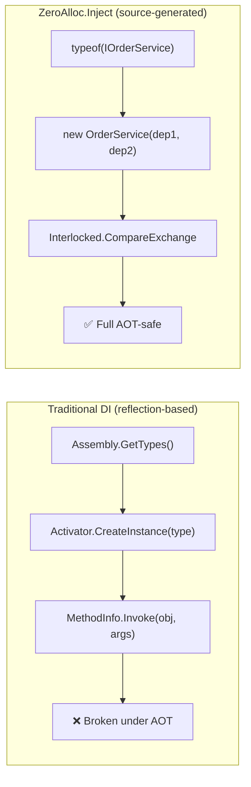
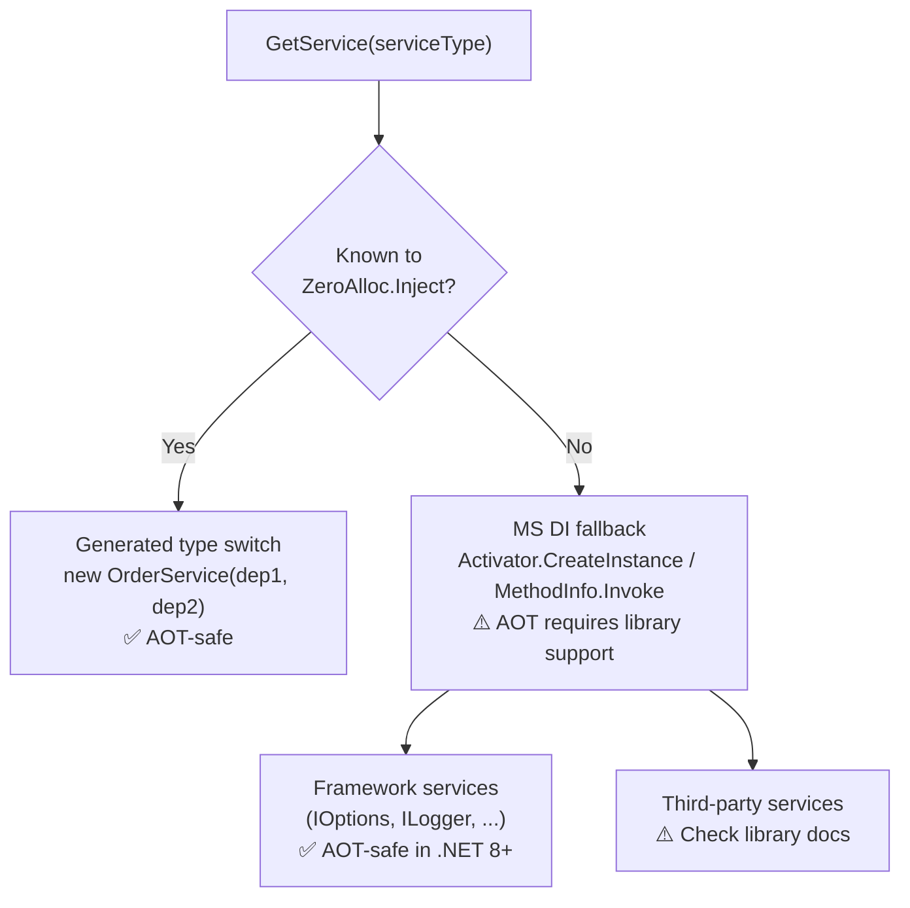

# Native AOT

Native AOT (Ahead-of-Time) compilation converts your .NET application into a self-contained native binary at publish time. The resulting executable requires no installed .NET runtime — the code is pre-compiled to machine instructions, not IL that a JIT compiler processes at startup. The practical benefits are significant: startup times drop from hundreds of milliseconds to single-digit milliseconds, RSS memory usage shrinks because there is no JIT compiler or reflection metadata kept in memory, and the deployment artifact is a single file with no framework dependency. Native AOT is particularly valuable for CLI tools, serverless functions, sidecar processes, and containerised microservices where cold-start latency and image size are first-class concerns.

The trade-off is that reflection is severely constrained or unavailable at runtime. The AOT compiler performs tree-shaking at publish time: any type or method not provably reachable from a root entry point can be trimmed from the binary. Most traditional DI containers — including plain `Microsoft.Extensions.DependencyInjection` — scan assemblies at startup with `Assembly.GetTypes()`, build internal registration tables keyed by `Type`, and instantiate services via `Activator.CreateInstance(type)` or `MethodInfo.Invoke()`. These operations either fail silently (returning `null` instead of an instance) or throw `InvalidOperationException` at runtime because the trimmer has removed the metadata those APIs depend on. ZeroAlloc.Inject avoids all of this: the Roslyn source generator emits plain `new ClassName(dep1, dep2)` constructor calls and `typeof(T)` type comparisons at compile time. By the time the AOT compiler runs, every service instantiation path is a statically visible direct call — nothing to discover, nothing to reflect on.

## Why ZeroAlloc.Inject Is AOT-Safe

The source generator emits three categories of code, all of which are fully supported by the AOT compiler and trimmer:

### 1. Direct Constructor Calls

For every annotated service the generator emits a plain `new` expression wired to the resolved dependencies:

```csharp
// Generated — excerpt from ResolveKnown
if (serviceType == typeof(IOrderService))
    return new OrderService(
        sp.GetRequiredService<IProductCatalog>(),
        sp.GetRequiredService<IPaymentGateway>());
```

The AOT compiler sees `new OrderService(...)` as a statically typed constructor call. No metadata is needed beyond what the compiler already knows about the constructor signature. The trimmer keeps `OrderService`, `IProductCatalog`, and `IPaymentGateway` because they appear as concrete reachable references.

### 2. `typeof(T)` Type Switches

Service resolution uses an `if`/`else if` chain comparing `serviceType` against `typeof(ConcreteOrInterfaceType)`:

```csharp
if (serviceType == typeof(IOrderService))   return ResolveOrderService();
else if (serviceType == typeof(IEmailGateway)) return ResolveEmailGateway();
else if (serviceType == typeof(IProductCatalog)) return ResolveProductCatalog();
```

`typeof(T)` is a compile-time token. The AOT compiler resolves it to an address in the read-only type metadata section. No runtime type lookup, no dictionary, no hash computation on a string type name.

### 3. `Interlocked.CompareExchange` for Singleton Initialization

Singletons are stored in generated fields and lazily initialised with a lock-free compare-exchange:

```csharp
private EmailGateway? _emailGateway;

private EmailGateway ResolveEmailGateway()
{
    if (_emailGateway != null) return _emailGateway;
    var instance = new EmailGateway();
    return Interlocked.CompareExchange(ref _emailGateway, instance, null) ?? _emailGateway;
}
```

`Interlocked.CompareExchange` is an intrinsic backed by a CPU atomic instruction (`LOCK CMPXCHG` on x64, `STLXR`/`LDAXR` on ARM64). The AOT compiler emits it as a single instruction sequence with no reflection or runtime metadata.

### What Traditional DI Containers Do Instead

The following patterns are the standard building blocks of reflection-based containers. All of them break under Native AOT:

| Pattern | API | AOT outcome |
|---------|-----|-------------|
| Assembly scanning | `Assembly.GetTypes()` | Returns an empty or partial array after trimming; services are silently missing |
| Reflection instantiation | `Activator.CreateInstance(type)` | Throws `MissingMethodException` if the constructor was trimmed |
| Reflection method dispatch | `MethodInfo.Invoke(instance, args)` | Throws `InvalidOperationException` or `NullReferenceException` if method metadata was trimmed |
| Open-generic resolution | `Type.MakeGenericType(typeArgs)` | May throw `NotSupportedException` on full AOT targets (e.g., iOS, WASM) |

ZeroAlloc.Inject generates none of the above. Every service instantiation path is a statically visible direct call that the trimmer can analyse without any runtime input.



## Compatibility Matrix

| Mode | AOT Compatible | Notes |
|------|---------------|-------|
| `AddXxxServices()` extension method | ✅ | Generated registration code is AOT-safe. Runtime resolution depends on your MS DI configuration. |
| Standalone container (closed generics) | ✅ | Direct `new` calls, `typeof(T)` type switches, `Interlocked.CompareExchange`. Zero reflection. |
| Standalone container (open generics) | ✅ | Closed types enumerated at compile time via constructor parameter analysis. Fully AOT-safe, provided at least one constructor parameter referencing the closed type exists in the assembly; otherwise ZAI018 is emitted and the type is not resolvable (see Limitations). |
| Hybrid container (known services) | ✅ | AOT-safe for services registered with ZeroAlloc.Inject. |
| Hybrid container (unknown services) | ⚠️ | Falls back to MS DI, which uses reflection. Not AOT-safe for the fallback path. |

The standalone container is the fully AOT-compatible mode. It has no runtime dependency on `Microsoft.Extensions.DependencyInjection` and emits zero reflection at runtime — including for open generics, where closed forms are enumerated at compile time via constructor parameter analysis.

## Publishing a Native AOT App

The following walkthrough builds a console application that resolves services with zero reflection and publishes as a single native binary.

### Step 1: Install the Container Package

```
dotnet add package ZeroAlloc.Inject.Container
```

This single package includes the source generator, the `[Transient]`, `[Scoped]`, and `[Singleton]` attributes, and the container base classes. No separate `ZeroAlloc.Inject` or `ZeroAlloc.Inject.Generator` package is required when using the container.

### Step 2: Annotate Your Services

Annotate services exactly as you would in any other mode. The AOT path requires no additional attributes or configuration on the service classes themselves:

```csharp
using ZeroAlloc.Inject;

[Transient]
public class OrderService : IOrderService
{
    public OrderService(IProductCatalog catalog, IPaymentGateway payment) { }
}

[Singleton]
public class EmailGateway : IEmailGateway
{
    public EmailGateway(SmtpOptions options) { }
}

[Scoped]
public class OrderRepository : IOrderRepository
{
    public OrderRepository(DatabaseContext db) { }
}

[Singleton]
public class SmtpOptions { }

[Scoped]
public class DatabaseContext { }
```

The generator analyses constructor parameters at compile time, builds the full dependency graph, detects cycles (ZAI014), and emits the provider.

### Step 3: Configure Your Project for AOT

Add the `PublishAot` property to your `.csproj`. `InvariantGlobalization` is recommended for console and worker scenarios — it reduces binary size by excluding ICU data:

```xml
<Project Sdk="Microsoft.NET.Sdk">
  <PropertyGroup>
    <OutputType>Exe</OutputType>
    <TargetFramework>net9.0</TargetFramework>
    <PublishAot>true</PublishAot>
    <InvariantGlobalization>true</InvariantGlobalization>
  </PropertyGroup>
</Project>
```

> **Note:** `PublishAot` requires .NET 8 or later and is currently supported for console applications and ASP.NET Core. Windows Forms and WPF are not supported.

### Step 4: Use the Standalone Container in Program.cs

Instantiate the generated provider directly — no `ServiceCollection`, no `BuildServiceProvider()`:

```csharp
using ZeroAlloc.Inject.Generated;

// Provider name: <AssemblyName>StandaloneServiceProvider
using var provider = new MyAppStandaloneServiceProvider();

var orderService = provider.GetRequiredService<IOrderService>();
await orderService.ProcessPendingOrdersAsync();
```

For scoped services, create and dispose a scope explicitly:

```csharp
using var provider = new MyAppStandaloneServiceProvider();

await using var scope = provider.CreateScope();
var repository = scope.ServiceProvider.GetRequiredService<IOrderRepository>();
var orders = await repository.GetPendingAsync();
```

### Step 5: Publish

```bash
dotnet publish -c Release -r win-x64
# or
dotnet publish -c Release -r linux-x64
# or
dotnet publish -c Release -r osx-arm64
```

> **Note:** `PublishAot` implies self-contained publishing — you do not need to pass `--self-contained` explicitly. The resulting binary carries its own runtime and requires no .NET installation on the target machine.

The output is a single self-contained native binary in `bin/Release/net9.0/<rid>/publish/`. No `.NET` runtime installation is required on the target machine.

Expected output for a typical service application:

```
Build succeeded.
  MyApp -> bin/Release/net9.0/win-x64/publish/MyApp.exe
```

### Full Example: Order Processing Worker

```csharp
// Program.cs
using ZeroAlloc.Inject.Generated;

using var provider = new OrderWorkerStandaloneServiceProvider();

// Singletons live for the provider lifetime
var gateway = provider.GetRequiredService<IEmailGateway>();

// Process batches — each batch gets its own scope
while (!cancellationToken.IsCancellationRequested)
{
    await using var scope = provider.CreateScope();
    var processor = scope.ServiceProvider.GetRequiredService<IBatchProcessor>();
    await processor.RunAsync(cancellationToken);
    // scope disposed here — DatabaseContext cleaned up
}
```

## Limitations and What to Avoid

### Hybrid Container + Unknown Services

The hybrid container's fallback path delegates unknown service types to MS DI:

```
ResolveKnown(serviceType) ?? _fallback.GetService(serviceType)
```

The `_fallback.GetService(serviceType)` call goes through MS DI's reflection-based resolver. If you publish a hybrid-mode app with `PublishAot`, any service resolved through the fallback may fail at runtime with a trimming error. Limit hybrid-mode AOT apps to cases where you are certain the fallback is never exercised, or switch to the standalone container if reflection-free resolution is a hard requirement.

### Third-Party Libraries

Many NuGet packages use reflection internally — even if they do not expose a DI container. Entity Framework Core, for example, uses reflection for model building. Check each library's AOT compatibility documentation before using it in a standalone AOT application. The .NET ecosystem tracks AOT compatibility via the `[RequiresUnreferencedCode]` and `[RequiresDynamicCode]` attributes; the AOT compiler will emit warnings when you reference methods bearing these attributes.

### The `dynamic` Keyword

`dynamic` is not supported under Native AOT. Any code path that uses `dynamic` will fail at publish time with a trim analysis warning and at runtime with a `PlatformNotSupportedException`. Replace `dynamic` with generic methods, interfaces, or `object` casts where needed.

### `Assembly.GetTypes()` in Application Code

If your own code calls `Assembly.GetTypes()`, `Assembly.GetExportedTypes()`, or similar scanning APIs, the results are unreliable after trimming. Types not reachable from a root entry point will be absent. Use the source generator's compile-time discovery instead: annotate the types you want registered and let the generator enumerate them.

### Open Generics with No Detected Closed Usages

In standalone mode, the generator discovers closed forms of open generic types by analysing constructor parameters across the assembly. If a closed form (e.g., `IRepository<Invoice>`) never appears as a constructor parameter anywhere in the assembly, the generator cannot include it in the type switch and emits a **ZAI018** warning:

```
ZAI018: Repository<T> has no detected closed usages in this assembly and will not be
        resolvable from the standalone container.
```

To fix this, ensure that the closed type is referenced as a constructor parameter at least once:

```csharp
// This constructor reference is enough for the generator to discover IRepository<Invoice>
[Transient]
public class InvoiceService : IInvoiceService
{
    public InvoiceService(IRepository<Invoice> repo) { }
}
```

### AOT-Incompatible Frameworks

The following project types do not support Native AOT as of .NET 9:

- Windows Forms (`<UseWindowsForms>true</UseWindowsForms>`)
- WPF (`<UseWPF>true</UseWPF>`)
- Blazor WebAssembly (uses its own AOT pipeline via Emscripten, not `PublishAot`)

For these project types, use the hybrid or extension-method mode without `PublishAot`.

## ASP.NET Core and AOT

ASP.NET Core introduced Native AOT support in .NET 8 for minimal API applications. The setup integrates with ZeroAlloc.Inject's hybrid container.

### Setup

```csharp
var builder = WebApplication.CreateSlimBuilder(args); // slim builder omits reflection-heavy middleware

builder.Services.AddMyAppServices();
builder.Host.UseServiceProviderFactory(new ZeroAllocInjectServiceProviderFactory());

var app = builder.Build();

app.MapGet("/orders/{id}", async (IOrderService orders, int id) =>
    await orders.GetByIdAsync(id));

app.Run();
```

`WebApplication.CreateSlimBuilder` (introduced in .NET 8) configures only the minimal set of middleware that is compatible with AOT trimming. `CreateBuilder` includes additional middleware that may emit trim warnings.

### What Is AOT-Safe in This Configuration

- Your services registered via ZeroAlloc.Inject are resolved through the generated type switch — AOT-safe.
- ASP.NET Core's own framework services (`IHostApplicationLifetime`, `IOptions<T>`, `IHttpContextAccessor`, etc.) are handled by ASP.NET Core's own AOT pipeline — AOT-safe as of .NET 8.
- Route parameter binding for primitive types and `[AsParameters]` structs is AOT-safe.

### What Requires Care

- Third-party middleware that uses reflection internally is not automatically AOT-safe. Check the middleware's documentation.
- `IServiceCollection`-based registrations for third-party packages (e.g., `AddOpenTelemetry()`, `AddAuthentication()`) may emit trim warnings. Review each package's AOT support status.
- The `GetRequiredService<T>()` pattern is fine for known types. Dynamic resolution via `GetService(typeof(T))` where `T` is a runtime-computed type is not.

### Hybrid Mode AOT Caution for ASP.NET Core

In a hybrid container configuration, your own ZeroAlloc.Inject services are resolved via the generated type switch. Framework services and third-party services resolved through the MS DI fallback travel through MS DI's standard runtime resolver. For a fully AOT-compliant ASP.NET Core app, every service resolved at runtime must be AOT-compatible — either because it is registered with ZeroAlloc.Inject (and thus resolved via generated code) or because the library providing it explicitly supports AOT.


