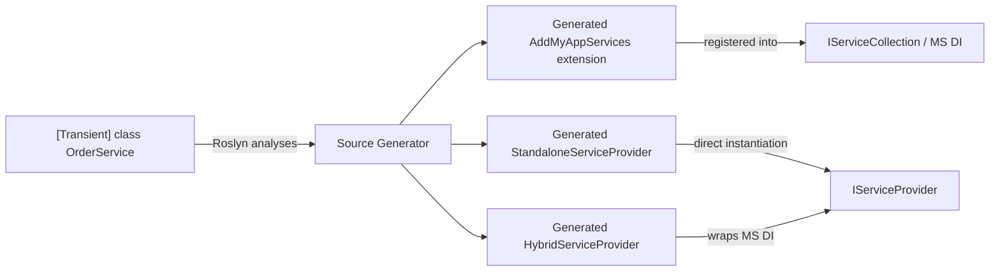
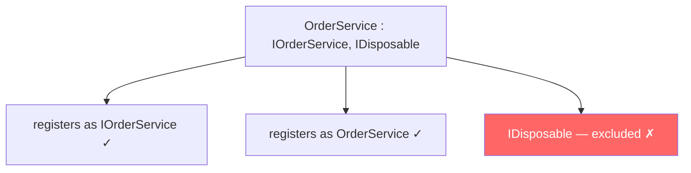
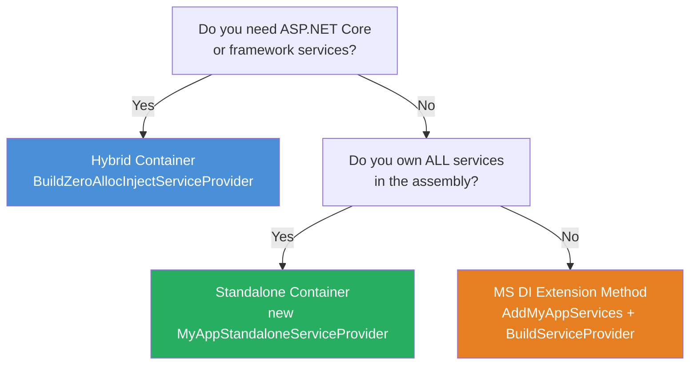
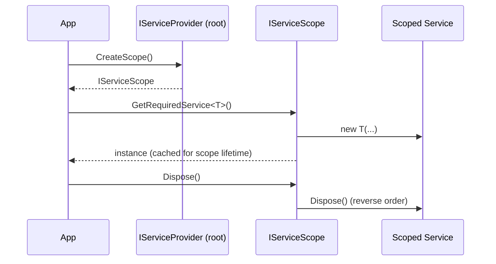
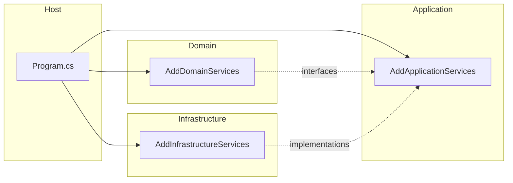

# ZeroAlloc.Inject Documentation Implementation Plan

> **For Claude:** REQUIRED SUB-SKILL: Use superpowers:executing-plans to implement this plan task-by-task.

**Goal:** Write extensive, real-world-grounded documentation for ZeroAlloc.Inject in `docs/`, split into narrative docs and a `reference/` subfolder, with all diagrams in Mermaid format.

**Architecture:** Approach C — narrative docs for learning, `reference/` subfolder for quick-lookup tables. 8 files total: 6 narrative, 2 reference.

**Tech Stack:** Markdown, Mermaid diagrams, .NET 8–10 / C# 12, ZeroAlloc.Inject attributes and container APIs.

---

## Context

ZeroAlloc.Inject is a Roslyn source-generator–based DI library. It auto-discovers services via attributes and generates:
1. An `IServiceCollection` extension method (e.g., `AddMyAppServices()`) — used alongside any MS DI container.
2. A Hybrid `IServiceProvider` — wraps the generated type-switch resolver around an MS DI fallback.
3. A Standalone `IServiceProvider` — zero MS DI dependency at runtime, fully Native AOT-compatible.

Key files to read for context:
- `README.md` — authoritative feature reference
- `samples/ZeroAlloc.Inject.Sample/` — real-world use cases (ProductCatalog, OrderProcessing, Notifications, Inventory)
- `src/ZeroAlloc.Inject/` — all public attributes
- `src/ZeroAlloc.Inject.Container/` — base classes for the two generated providers

Docs go in `docs/` (already created). `docs/reference/` subfolder also already exists.

---

## Task 1: `docs/getting-started.md`

**Files:**
- Create: `docs/getting-started.md`

**Step 1: Write the file**

Content must include:
- H1 title
- "What is ZeroAlloc.Inject?" — one paragraph, cover: compile-time, source generator, no reflection, Native AOT.
- ## Installation — three tabs/sections: attributes-only, attributes+generator, all-in-one Container package
- ## Your First Service — minimal working example (annotate a class, call generated method in `Program.cs`)
- ## How It Works — Mermaid flowchart of the generator pipeline
- ## Next Steps — bullet links to the other docs

Mermaid diagram (generator pipeline):



**Step 2: Commit**

```bash
git add docs/getting-started.md
git commit -m "docs: add getting-started guide"
```

---

## Task 2: `docs/service-registration.md`

**Files:**
- Create: `docs/service-registration.md`

**Step 1: Write the file**

Content must include:
- H1 title
- ## Lifetime Attributes — table + code blocks for `[Transient]`, `[Scoped]`, `[Singleton]`
- ## Default Interface Discovery — how the generator maps a class to its interfaces; list of excluded system interfaces (`IDisposable`, `IAsyncDisposable`, `IComparable<T>`, `IEquatable<T>`, `IFormattable`, `ICloneable`, `IConvertible`)
- ## Narrowing with `As` — code example (`IReadRepository<T>` only)
- ## Keyed Services — code example with `Key = "redis"` / `Key = "memory"`, note .NET 8+ requirement
- ## Allowing Multiple Registrations — `AllowMultiple = true`, real-world example with multiple `IHostedService`
- ## Open Generics — `Repository<T>` example; note ZAI018 warning for standalone mode
- ## Custom Extension Method Name — `[assembly: ZeroAllocInject("AddDomainServices")]`
- ## Real-World Patterns section with three subsections:
  - Repository pattern (interface + concrete + `[Scoped]`)
  - Background workers (`[Singleton(AllowMultiple = true)]` on multiple `IHostedService`)
  - Read/write repository split using `As`

Mermaid diagram (interface mapping):



**Step 2: Commit**

```bash
git add docs/service-registration.md
git commit -m "docs: add service registration guide"
```

---

## Task 3: `docs/decorators.md`

**Files:**
- Create: `docs/decorators.md`

**Step 1: Write the file**

Content must include:
- H1 title
- Intro paragraph — what the Decorator pattern is and why compile-time wiring is better than runtime
- ## `[Decorator]` — Simple Form — code example (LoggingProductRepository from the sample), how the generator detects the matching interface via constructor parameter
- ## `[DecoratorOf]` — Explicit Form — when to use it (multiple interfaces, explicit ordering), code example
- ## Decorator Ordering — `Order` property, ascending = innermost first, code + diagram
- ## Conditional Decorators — `WhenRegistered` property, feature flag example (only add `TracingRetriever` when `TracingOptions` is registered)
- ## Optional Dependencies — `[OptionalDependency]` on nullable constructor parameter, `GetService<T>()` vs `GetRequiredService<T>()`
- ## Real-World Example — full three-layer stack: caching → logging → real impl, with code for all three classes

Mermaid diagram (decorator chain):


**Step 2: Commit**

```bash
git add docs/decorators.md
git commit -m "docs: add decorators guide"
```

---

## Task 4: `docs/container-modes.md`

**Files:**
- Create: `docs/container-modes.md`

**Step 1: Write the file**

Content must include:
- H1 title
- Intro — three modes overview, when each exists
- ## Choosing a Mode — Mermaid decision flowchart
- ## Mode 1: MS DI Extension Method — code example (`AddMyAppServices()` + `BuildServiceProvider()`), what gets generated, limitations (still uses MS DI at runtime)
- ## Mode 2: Hybrid Container — ASP.NET Core code example (`UseServiceProviderFactory`), Console App code example (`BuildZeroAllocInjectServiceProvider()`), how it wraps MS DI for unknown types
- ## Mode 3: Standalone Container — code example (`new MyAppStandaloneServiceProvider()`), scope lifecycle, no MS DI dependency
- ## Scope Lifecycle — Mermaid diagram
- ## Trade-off Table — rows: startup cost, AOT compatibility, framework service support, open generics, memory per scope

Mermaid decision flowchart:



Mermaid scope lifecycle diagram:



**Step 2: Commit**

```bash
git add docs/container-modes.md
git commit -m "docs: add container modes guide"
```

---

## Task 5: `docs/advanced.md`

**Files:**
- Create: `docs/advanced.md`

**Step 1: Write the file**

Content must include:
- H1 title
- ## Multi-Assembly Setup — each assembly generates its own `AddXxxServices()` method; show how to chain calls in `Program.cs`; Mermaid diagram of assembly dependency graph
- ## Multiple Constructors — `[ActivatorUtilitiesConstructor]` attribute, why the generator requires disambiguation (ZAI009), code example
- ## Resolving All Implementations — `IEnumerable<T>` + `AllowMultiple = true`, real-world example (pipeline steps, validators)
- ## Scoped-Inside-Singleton Pitfall — what captive dependency is, why it's a bug, how the generator catches it at compile time, example that triggers ZAI014
- ## Open Generics in Standalone Mode — how the generator enumerates closed types via constructor parameter analysis, ZAI018 warning, workaround

Mermaid multi-assembly diagram:



**Step 2: Commit**

```bash
git add docs/advanced.md
git commit -m "docs: add advanced patterns guide"
```

---

## Task 6: `docs/native-aot.md`

**Files:**
- Create: `docs/native-aot.md`

**Step 1: Write the file**

Content must include:
- H1 title
- Intro — what Native AOT is and why it matters; link to .NET AOT docs
- ## Why ZeroAlloc.Inject Is AOT-Safe — generator emits plain `new ClassName(...)`, `typeof(T)` switches, `Interlocked.CompareExchange`; zero reflection in generated code
- ## Compatibility Matrix — table with columns: Mode, AOT Compatible, Notes
- ## Publishing a Native AOT App — step-by-step: add `<PublishAot>true</PublishAot>` to csproj, use Standalone container, `dotnet publish` command, expected output
- ## Limitations and What to Avoid — hybrid + unknown services falls back to MS DI reflection; open generic caveats

AOT compatibility matrix:

| Mode | AOT Compatible | Notes |
|------|---------------|-------|
| `AddXxxServices()` extension method | ✅ | Generated code is AOT-safe; runtime resolution depends on MS DI |
| Standalone container (closed generics) | ✅ | Direct `new` calls, zero reflection |
| Standalone container (open generics) | ✅ | Closed types enumerated at compile time |
| Hybrid container (known services) | ✅ | AOT-safe for ZeroAlloc.Inject-registered services |
| Hybrid container (unknown services) | ⚠️ | Falls back to MS DI reflection |

**Step 2: Commit**

```bash
git add docs/native-aot.md
git commit -m "docs: add native AOT guide"
```

---

## Task 7: `docs/reference/diagnostics.md`

**Files:**
- Create: `docs/reference/diagnostics.md`

**Step 1: Write the file**

Content must include:
- H1 title
- Brief intro — all diagnostics are emitted at compile time by the Roslyn source generator
- Full table with columns: **ID**, **Severity**, **Description**, **Cause**, **Fix**
- All 18 diagnostics ZAI001–ZAI018

Full diagnostics data (from README + DiagnosticDescriptors.cs):

| ID | Severity | Description | Cause | Fix |
|----|----------|-------------|-------|-----|
| ZAI001 | Error | Multiple lifetime attributes on same class | `[Transient]` and `[Singleton]` both on the same class | Remove all but one lifetime attribute |
| ZAI002 | Error | Attribute on non-class type | Applied to a struct, interface, or record struct | Move attribute to a class |
| ZAI003 | Error | Attribute on abstract or static class | Abstract/static classes cannot be instantiated | Use on concrete classes only |
| ZAI004 | Error | `As` type not implemented by the class | `As = typeof(IFoo)` but class does not implement `IFoo` | Implement the interface or correct the `As` type |
| ZAI005 | Error | `Key` used below .NET 8 | Keyed services require .NET 8+ | Upgrade target framework or remove `Key` |
| ZAI006 | Warning | No public constructor | Generator cannot wire up dependencies | Add a `public` constructor |
| ZAI007 | Warning | No interfaces (concrete-only registration) | Class implements no non-system interfaces | Expected if intentional; resolve with a concrete-only registration |
| ZAI008 | Warning | Missing `Microsoft.Extensions.DependencyInjection.Abstractions` | Required package not referenced | Add package reference |
| ZAI009 | Error | Multiple public constructors without `[ActivatorUtilitiesConstructor]` | Ambiguous constructor selection | Mark the intended constructor with `[ActivatorUtilitiesConstructor]` |
| ZAI010 | Error | Constructor parameter is a primitive/value type | DI cannot inject `int`, `bool`, etc. | Remove primitive from constructor; use options pattern instead |
| ZAI011 | Error | Decorator has no matching interface parameter | `[Decorator]` class constructor lacks a parameter of the decorated interface type | Add a constructor parameter for the interface being decorated |
| ZAI012 | Error | Decorated interface not registered as a service | The interface the decorator wraps has no registered implementation | Register the underlying service before the decorator |
| ZAI013 | Warning | Decorator on abstract or static class | Abstract/static classes cannot be instantiated as decorators | Use on concrete classes only |
| ZAI014 | Error | Circular dependency detected | Service A depends on B which depends on A | Refactor to break the cycle (e.g., introduce a factory or lazy wrapper) |
| ZAI015 | Error | `[OptionalDependency]` on non-nullable parameter | `GetService<T>()` can return null; parameter must be nullable | Change parameter type to `T?` |
| ZAI016 | Error | `[DecoratorOf]` interface not implemented by the class | The explicit interface listed in `[DecoratorOf]` is not on the class | Implement the interface or correct the type argument |
| ZAI017 | Error | Two decorators for the same interface share the same `Order` | Ambiguous decorator ordering | Assign unique `Order` values |
| ZAI018 | Warning | Open generic has no detected closed usages | Standalone container cannot enumerate closed types | Ensure a constructor parameter of the closed type exists somewhere in the assembly |

**Step 2: Commit**

```bash
git add docs/reference/diagnostics.md
git commit -m "docs: add diagnostics reference"
```

---

## Task 8: `docs/reference/benchmarks.md`

**Files:**
- Create: `docs/reference/benchmarks.md`

**Step 1: Write the file**

Content must include:
- H1 title
- ## Methodology — BenchmarkDotNet v0.15.8, .NET 9.0, Windows 11, Intel Core i9-12900HK, X64 RyuJIT AVX2; what each benchmark measures
- ## Registration / Startup — table from README
- ## Resolution — table from README with all scenarios
- ## Interpretation — when to choose Standalone vs Hybrid vs plain MS DI, what the memory numbers mean in practice
- ## Running the Benchmarks Yourself — `dotnet run -c Release --project benchmarks/...`

**Step 2: Commit**

```bash
git add docs/reference/benchmarks.md
git commit -m "docs: add benchmarks reference"
```

---

## Task 9: Verify all files exist and are internally consistent

**Step 1: Check all 8 files are present**

```bash
find docs -name "*.md" | sort
```

Expected output:
```
docs/getting-started.md
docs/service-registration.md
docs/decorators.md
docs/container-modes.md
docs/advanced.md
docs/native-aot.md
docs/reference/diagnostics.md
docs/reference/benchmarks.md
```

**Step 2: Verify cross-links are correct** — each narrative doc should link forward/backward to related docs.

**Step 3: Final commit**

```bash
git add docs/
git commit -m "docs: complete ZeroAlloc.Inject documentation"
```
