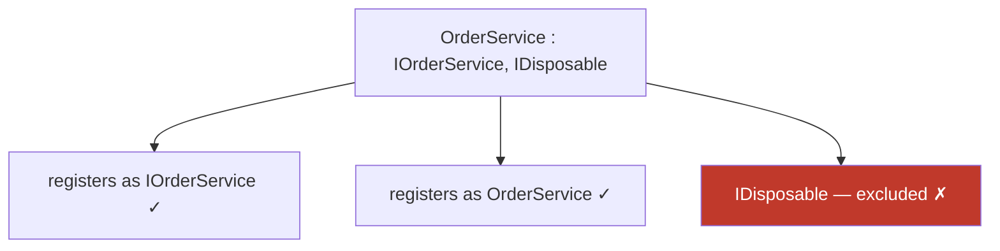

# Service Registration

ZeroAlloc.Inject eliminates boilerplate DI wiring by letting you express lifetime intent directly on your class. You annotate your implementation with `[Transient]`, `[Scoped]`, or `[Singleton]`; the Roslyn source generator reads those attributes at compile time and emits the corresponding `IServiceCollection.Add*` call inside a generated extension method. There is no runtime assembly scanning, no reflection, and no `BuildServiceProvider` guesswork — if something is wrong (e.g., a typo in `As`, a missing interface, an incompatible target framework), you get a compiler error or warning before the application ever starts.

## Lifetime Attributes

Each lifetime maps directly to its Microsoft.Extensions.DependencyInjection counterpart. All three share the same base `ServiceAttribute` and support the same optional properties (`As`, `Key`, `AllowMultiple`).

| Attribute | Lifetime | MS DI equivalent | When to use |
|---|---|---|---|
| `[Transient]` | New instance every time the service is resolved | `AddTransient` | Lightweight, stateless services; services with per-operation state (e.g., a builder, a formatter) |
| `[Scoped]` | One instance per scope (one per HTTP request in ASP.NET Core) | `AddScoped` | Unit-of-work objects, EF Core `DbContext` wrappers, per-request state |
| `[Singleton]` | Single instance shared for the entire application lifetime | `AddSingleton` | Thread-safe caches, gateways, configuration facades, expensive-to-build resources |

### [Transient]

A new instance is created every time the type is requested from the container. Transient services are ideal for lightweight, stateless work — each consumer gets its own copy and there is no shared mutable state to worry about.

```csharp
using ZeroAlloc.Inject;

[Transient]
public class OrderService : IOrderService
{
    private readonly IProductRepository _products;
    private readonly IOrderContext _context;

    public OrderService(IProductRepository products, IOrderContext context)
    {
        _products = products;
        _context  = context;
    }

    public void AddToCart(int productId, int qty)
    {
        var product = _products.GetById(productId)
            ?? throw new InvalidOperationException($"Product {productId} not found.");
        _context.AddLine(product, qty);
    }

    public void Checkout()
    {
        Console.WriteLine("Order summary:");
        _context.Print();
    }
}
```

`OrderService` is stateless itself — it delegates all state to its dependencies — so a new instance per resolution is cheap and correct.

### [Scoped]

One instance per scope. In ASP.NET Core every HTTP request is a scope, so the same object is reused throughout a single request and then discarded. This is the right lifetime for objects that hold per-request context, like an order basket or an EF Core `DbContext`.

```csharp
using ZeroAlloc.Inject;

[Scoped]
public class OrderContext : IOrderContext
{
    private readonly List<(Product Product, int Qty)> _lines = [];

    public void AddLine(Product product, int qty) => _lines.Add((product, qty));

    public decimal Total => _lines.Sum(l => l.Product.Price * l.Qty);

    public void Print()
    {
        foreach (var (product, qty) in _lines)
            Console.WriteLine($"  {qty}x {product.Name} @ {product.Price:C} = {product.Price * qty:C}");
        Console.WriteLine($"  Total: {Total:C}");
    }
}
```

Because `OrderContext` accumulates line items across multiple service calls within the same request, a single scoped instance is exactly what is needed. Creating a new instance per resolution would silently discard the accumulated basket.

### [Singleton]

A single instance is created on first resolution and reused for the entire application lifetime. Singletons are appropriate for thread-safe, shared resources — external gateways, in-memory caches, or configuration objects that are expensive to initialise.

```csharp
using ZeroAlloc.Inject;

[Singleton]
public class ConsoleEmailGateway : IEmailGateway
{
    private int _sent;

    public void Send(string to, string subject, string body)
    {
        _sent++;
        Console.WriteLine($"[email #{_sent}] To: {to} | Subject: {subject}");
    }
}
```

> **Caution:** Never inject a Scoped or Transient service into a Singleton — the shorter-lived service will be captured and won't be refreshed. The MS DI runtime will throw a `InvalidOperationException` (scope validation) in development mode if you do this.

## Default Interface Discovery

When you annotate a class without specifying `As`, the generator automatically registers the service against **every interface the class directly implements**, plus its **concrete type**. This means a single attribute is usually sufficient — you do not need to list your interfaces explicitly.

### System interface exclusions

Certain framework interfaces that almost every class implements incidentally are excluded from registration to prevent polluting the container:

- `IDisposable`, `IAsyncDisposable`
- `IComparable`, `IComparable<T>`, `IEquatable<T>`
- `IFormattable`, `ICloneable`, `IConvertible`

If your class implements `IOrderService` and `IDisposable`, only `IOrderService` (and the concrete type) will be registered:



The generated code for the above would look like:

```csharp
services.TryAddTransient<IOrderService>(sp => new OrderService());
services.TryAddTransient(sp => new OrderService());
```

### TryAdd semantics

All registrations use `TryAdd` variants by default. `TryAdd` only registers a service type if it is **not already present** in the `IServiceCollection`. This means:

- Calling the generated extension method twice is safe — the second call is a no-op for every service.
- Registering the same interface in two separate assemblies and combining both extension methods will result in the first registration winning. The second is silently skipped.
- This is consistent with the convention used by ASP.NET Core framework services themselves.

To override this behaviour and force registration even when the type is already registered, see [Allowing Multiple Registrations](#allowing-multiple-registrations).

## Narrowing Registration with `As`

By default the generator registers against all discovered interfaces. When a class implements multiple interfaces and you only want it to be resolvable through one, set the `As` property to pin the registration to a single service type.

A repository that handles both reads and writes is a common example. If you want consumers to depend only on the read contract (to enforce segregation), set `As = typeof(IReadRepository<Product>)`:

```csharp
public interface IReadRepository<T>
{
    T? GetById(int id);
    IReadOnlyList<T> GetAll();
}

public interface IWriteRepository<T>
{
    void Add(T entity);
    void Remove(int id);
}

// Only resolvable as IReadRepository<Product> — IWriteRepository<Product> is not registered
[Scoped(As = typeof(IReadRepository<Product>))]
public class ProductRepository : IReadRepository<Product>, IWriteRepository<Product>
{
    private readonly List<Product> _store = [];

    public Product? GetById(int id) => _store.Find(p => p.Id == id);
    public IReadOnlyList<Product> GetAll() => _store;
    public void Add(Product entity) => _store.Add(entity);
    public void Remove(int id) => _store.RemoveAll(p => p.Id == id);
}
```

The generator validates that the `As` type is actually implemented by the class. If not, you get a **ZAI004** compile error, so mistakes are caught before runtime.

> **Important:** When `As` is set, the generator registers **only** the named type. The concrete type is **not** additionally registered. In the example above, only `IReadRepository<Product>` is registered — `ProductRepository` itself is not:
>
> ```csharp
> // Generates ONLY:
> services.TryAddTransient<IReadRepository<Product>>(sp => new ProductRepository());
> // NOT: services.TryAddTransient(sp => new ProductRepository()); ← concrete not registered
> ```
>
> As a result, `provider.GetService<ProductRepository>()` returns `null`.

`As` also accepts open generic type arguments. See [Open Generics](#open-generics) for details.

## Keyed Services (.NET 8+)

When multiple implementations of the same interface must coexist in the container simultaneously, keyed registration lets consumers select the specific implementation they want by name. This is built on top of the `IKeyedServiceProvider` API introduced in .NET 8.

A typical use case is providing two caching backends — Redis for distributed caching, in-memory for local fallback:

```csharp
public interface ICache
{
    void Set(string key, string value, TimeSpan ttl);
    string? Get(string key);
}

[Singleton(Key = "redis")]
public class RedisCache : ICache
{
    public void Set(string key, string value, TimeSpan ttl) { /* ... */ }
    public string? Get(string key) { /* ... */ return null; }
}

[Singleton(Key = "memory")]
public class MemoryCache : ICache
{
    private readonly Dictionary<string, string> _store = new();

    public void Set(string key, string value, TimeSpan ttl) => _store[key] = value;
    public string? Get(string key) => _store.GetValueOrDefault(key);
}
```

To resolve a specific implementation, use `GetRequiredKeyedService<T>`:

```csharp
var cache = provider.GetRequiredKeyedService<ICache>("redis");
cache.Set("session:abc123", "{ \"userId\": 42 }", TimeSpan.FromMinutes(30));
```

In ASP.NET Core, you can also inject keyed services directly via constructor parameters using the `[FromKeyedServices]` attribute:

```csharp
public class ReportService
{
    public ReportService([FromKeyedServices("redis")] ICache distributedCache) { }
}
```

> **Requirement:** `Key` requires .NET 8 or later. If you use `Key` on a project targeting .NET 7 or earlier, the generator emits a **ZAI005** compile error:
>
> ```
> ZAI005  error  'Key' is not supported on .NET 7 targets. Keyed services require .NET 8+.
> ```

## Allowing Multiple Registrations

The default `TryAdd` semantics mean that only the first registration of a given service type survives. This is usually the right behaviour, but it breaks down for scenarios where you deliberately want multiple implementations of the same interface to be registered — for example, multiple `IHostedService` background workers.

Set `AllowMultiple = true` to switch from `TryAdd` to a plain `Add`, which appends the registration regardless of what is already present:

```csharp
[Singleton(AllowMultiple = true)]
public class MetricsWorker : IHostedService
{
    public Task StartAsync(CancellationToken cancellationToken) { /* ... */ return Task.CompletedTask; }
    public Task StopAsync(CancellationToken cancellationToken) { /* ... */ return Task.CompletedTask; }
}

[Singleton(AllowMultiple = true)]
public class HealthCheckWorker : IHostedService
{
    public Task StartAsync(CancellationToken cancellationToken) { /* ... */ return Task.CompletedTask; }
    public Task StopAsync(CancellationToken cancellationToken) { /* ... */ return Task.CompletedTask; }
}
```

The generated code uses `Add` instead of `TryAdd`:

```csharp
services.AddSingleton<IHostedService, MetricsWorker>();
services.AddSingleton<IHostedService, HealthCheckWorker>();
```

The MS DI runtime collects all registrations for `IHostedService` and makes them available as `IEnumerable<IHostedService>`. ASP.NET Core's host infrastructure already resolves hosted services this way, so both workers will be started and stopped automatically.

> **Note:** `AllowMultiple` affects **all** service types generated for that class. If a class implements three interfaces and you set `AllowMultiple = true`, all three registrations use `Add`.

## Open Generics

ZeroAlloc.Inject supports open generic registrations. When the generator encounters a class with a type parameter that maps directly to an open generic interface, it emits an open generic `ServiceDescriptor`:

```csharp
[Scoped]
public class Repository<T> : IRepository<T>
{
    private readonly List<T> _store = [];

    public T? GetById(int id) => _store.ElementAtOrDefault(id);
    public IReadOnlyList<T> GetAll() => _store;
    public void Add(T entity) => _store.Add(entity);
}
```

The generator emits:

```csharp
services.TryAdd(ServiceDescriptor.Scoped(typeof(IRepository<>), typeof(Repository<>)));
```

This single registration covers all closed types — `IRepository<Product>`, `IRepository<Order>`, `IRepository<Customer>` — without requiring a separate attribute on each.

### Standalone and hybrid container note (ZAI018)

The generated container cannot resolve open generics dynamically because it uses a compile-time type switch. This applies to both **standalone mode** (no MS DI runtime) and **hybrid mode**. The generator analyses constructor parameters across the assembly to enumerate all closed usages at build time. If you use `[Scoped]` on an open generic class but no constructor in the assembly ever takes `IRepository<SomeType>` as a parameter, the generator emits a **ZAI018 warning**:

```
ZAI018  warning  Open generic 'Repository<T>' is registered but no closed usages were detected in this assembly. It will not be resolvable from the standalone or hybrid container.
```

This warning fires in both modes because the generated container — not the MS DI fallback — is responsible for resolving registered types, and it cannot handle open generics that have no detected closed usages at compile time.

## Customising the Extension Method Name

By default the generator derives the extension method name from the assembly name. `MyApp.Domain` becomes `AddMyAppDomainServices()`. To override this, apply the `ZeroAllocInject` assembly attribute:

```csharp
[assembly: ZeroAllocInject("AddDomainServices")]
```

The string is used **verbatim** as the method name. No prefix or suffix is added. The call site becomes:

```csharp
builder.Services.AddDomainServices();
```

This attribute is useful when:

- You want a short, ergonomic name that does not reflect the assembly name.
- You need to keep the call site stable when renaming assemblies during a refactor.
- You are writing a reusable library and want the consumer to use a descriptive name.

> There must be at most one `[assembly: ZeroAllocInject(...)]` attribute per assembly. Applying it multiple times produces a compile error.

## Real-World Patterns

### Repository Pattern

The repository pattern benefits from `[Scoped]` because each request gets an isolated unit-of-work context, and the repository naturally lives for the same duration as that context.

```csharp
public interface IProductRepository
{
    IReadOnlyList<Product> GetAll();
    Product? GetById(int id);
    void Save(Product product);
}

[Scoped]
public class SqlProductRepository : IProductRepository
{
    private readonly AppDbContext _db;

    public SqlProductRepository(AppDbContext db)
    {
        _db = db;
    }

    public IReadOnlyList<Product> GetAll() => _db.Products.ToList();
    public Product? GetById(int id) => _db.Products.Find(id);
    public void Save(Product product) => _db.SaveChanges();
}
```

The generator registers `SqlProductRepository` as both `IProductRepository` and `SqlProductRepository` using `TryAddScoped`. Consumers declare `IProductRepository` in their constructors and never need to know about the SQL implementation.

### Multiple Background Workers

When building a service host with several independent background workers, each worker must be individually registered under `IHostedService`. Because the default `TryAdd` semantics would skip the second and subsequent registrations, set `AllowMultiple = true` on every worker:

```csharp
[Singleton(AllowMultiple = true)]
public class EmailWorker : IHostedService
{
    public Task StartAsync(CancellationToken cancellationToken)
    {
        // Start processing outbox emails
        return Task.CompletedTask;
    }

    public Task StopAsync(CancellationToken cancellationToken)
    {
        // Drain the queue gracefully
        return Task.CompletedTask;
    }
}

[Singleton(AllowMultiple = true)]
public class ReportWorker : IHostedService
{
    public Task StartAsync(CancellationToken cancellationToken)
    {
        // Start scheduled report generation
        return Task.CompletedTask;
    }

    public Task StopAsync(CancellationToken cancellationToken)
    {
        return Task.CompletedTask;
    }
}
```

The ASP.NET Core host resolves `IEnumerable<IHostedService>` internally and starts every worker. You can also inject `IEnumerable<IHostedService>` in your own code if you need to inspect or coordinate the registered workers.

### Read/Write Repository Split

For strict separation of read and write concerns — e.g., to enforce that query handlers never accidentally call mutating methods — use `As` with an open generic interface to limit what consumers can resolve:

```csharp
public interface IReadRepository<T>
{
    T? GetById(int id);
    IReadOnlyList<T> GetAll();
}

public interface IWriteRepository<T>
{
    void Add(T entity);
    void Update(T entity);
    void Delete(int id);
}

[Scoped(As = typeof(IReadRepository<>))]
public class Repository<T> : IReadRepository<T>, IWriteRepository<T>
{
    private readonly AppDbContext _db;

    public Repository(AppDbContext db) => _db = db;

    public T? GetById(int id) => _db.Set<T>().Find(id);
    public IReadOnlyList<T> GetAll() => _db.Set<T>().ToList();
    public void Add(T entity) => _db.Set<T>().Add(entity);
    public void Update(T entity) => _db.Set<T>().Update(entity);
    public void Delete(int id) { /* ... */ }
}
```

Only `IReadRepository<>` is registered. Any attempt to inject `IWriteRepository<T>` will fail at startup with a missing registration exception, making the architectural boundary enforced by the container rather than only by code review.
